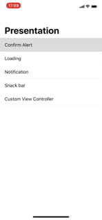
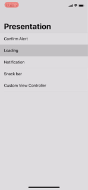
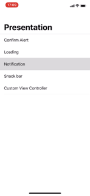
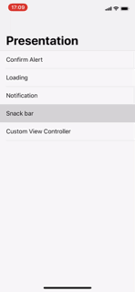

<p align="center">
  <!--  -->
  <br/><a href="https://cocoapods.org/pods/PresentationSettings">
  
  
  
  
  <br/>
  
  
  <br/>
  
  
  
  </a>
</p>

# Introduction

## What's this?

Configuration for `UIViewController` presentation.


## Preview

<table>
<tr>
<td></td>
<td></td>
</tr>
<tr>
<td></td>
<td></td>
</tr>
</table>


## Requirements

* iOS 8.0+
* Xcode 9 with Swift 4

## Installation

#### CocoaPods

```ruby
pod 'PresentationSettings'
```

## Contribution

You are welcome to fork and submit pull requests.

## License

`PresentationSettings` is open-sourced software, licensed under the `MIT` license.

## Usage

The simplest way:

```swift
@IBAction func showAlert(_ sender: UIButton) {
    let alert = SomeController.init()
    self.present(viewController: alert, settings: .default, animated: true, completion: nil)
}
```

Create your custom presentation settings:

```swift
let type = PresentationType.dynamic(center: .center)
let settings = PresentationSettings.init(presentationType: type)
settings.transitionType = nil
settings.dismissTransitionType = nil
settings.dismissAnimated = true
settings.dismissOnSwipe = false
settings.dismissOnTap = false
settings.keyboardTranslationType = .moveUp
....
```
